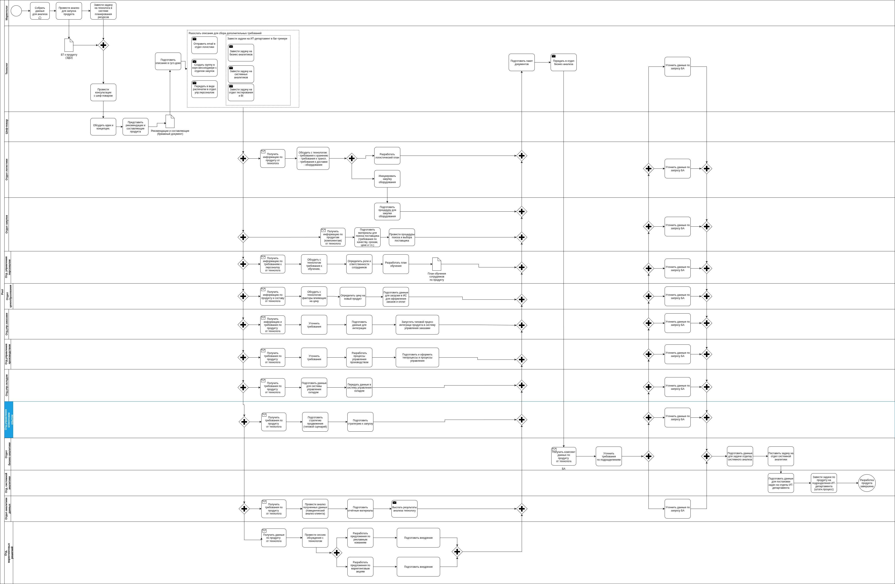
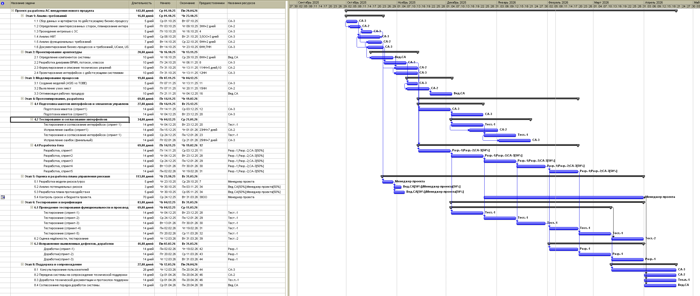
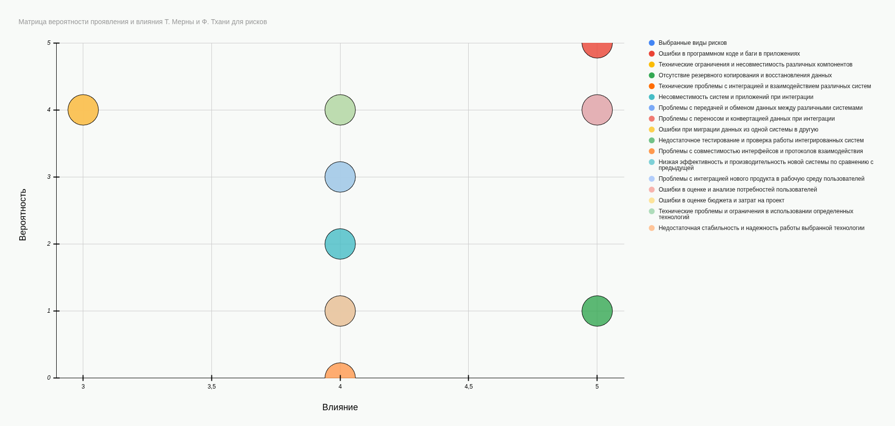
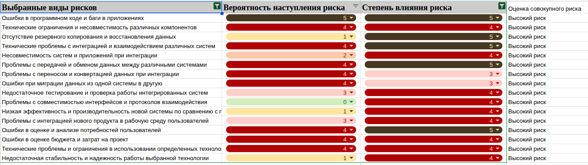
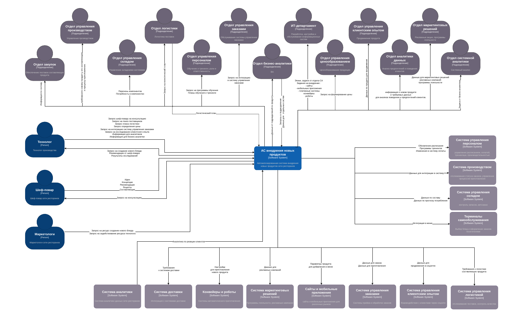
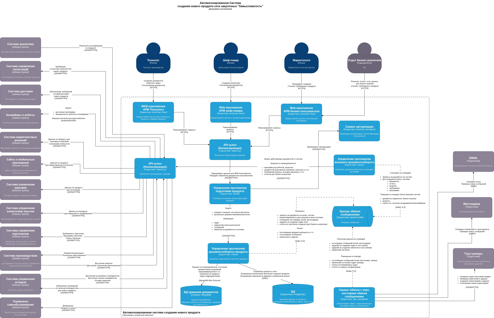

= Проект по разработке системы внедрения новых продуктов в сети закусочных "Замысловатость"

== Общая информация

Проект реализуется в рамках задач по оптимизации бизнес-процессов внутри компании (внутренний проект).

Проект нацелен на бизнес-процесс разработки и внедрения новых продуктов в сети закусочных.

Текущий процесс организован с большим количеством личного взаимодействия, привлечением различных систем для сходных задач, что приводит к таким недостаткам как:

* потеря информации
* избыточность коммуникаций (перезапросы)
* сложности в передаче документации в различные подразделения
* чрезмерной общей длительности процесса внедрения

Ключевой задачей в рамках проектной работы является реализация механизмов автоматизации внедрения новых продуктов в сети межконтинентальных закусочных “Замысловатость”.

Результатом проекта будет разработка автоматизированной системы (АС), позволяющей максимально автоматизировать рутинные операции (передача документов между системами, взаимодействие подразделений, хранение документации, внедрение нового продукта).

== Цели внедрения проекта.
Основная цель проекта: внедрение автоматизации при добавлении новых продуктов в сети закусочных. Перефразируя: разработка АС, интегрируемой в существующую автоматизированную систему управления сетью закусочных (включая СУ заказами, производством, СХД и т.п.)

Проект разрабатывается и внедряется для достижения следующего:

* Привести к единому стандарту
* накопления архива для расширения вомзожностей анализа
* упрощения процесса взаимодействия и передачи артефактов между подразделениями
* автоматизации рутинных задач
* автоматизации внедрения (передачи в целевые системы)
* Целевыми показателями успешности проекта являются:
* Увеличение количества внедряемых продуктов за 1 месяц (с 1 до 6) за счёт:
* сокращения трудоёмкости разработки и внедрения нового продукта
* сокращения сроков разработки и внедрения
* сохранение артефактов разработанных в процессе внедрения

== Описание проекта и основных решаемых задач 

Получаемая в результате реализации проекта автоматизированная система (АС) автоматизирует бизнес-процесс разработки продукта.

Текущее состояние бизнес-процесса (AS IS) представлено на BPMN-диаграмме:

В рамках автоматизации, разрабатываемая система призвана решать следующие задачи:

* Предоставление интерфейса основным пользователям:
** Маркетологи
** Технолог
** Шеф-повар
** Бизнес-аналитики
* Обеспечение интерфейса с корп. системами для включения в процесс других бизнес-пользователей:
** Электронной почты
** Корпоративный мессенджер
** Таск-трекер
* Выполнение основной бизнес-логики протокола подготовки продукта
* Разграничение в рамках основного протокола разработки продутка доступа к информации, прав на создание артефактов и сообщений
* Получение (сбор) артефактов из внешних систем:
** Система управления производством
** Система управления складом
** Система управления логистикой
** Система управления персоналом
** Система управления клиентским опытом
** Система аналитики данных
** Система управления конверерами и роботами
** Система маркетинговых решений
** Системы безопасности
* Размещение артефактов во внешних системах:
** Сайты и мобильные приложения
** Терминалы самообслуживания
** Система управления заказами
** Система управления производством
** Система управления складом
** Система управления логистикой
** Система управления персоналом
** Платежные системы
** Система управления конверерами и роботами
** Система доставки
** Система маркетинговых решений
** Системы безопасности
* Сбор и хранение информации:
** о выполнении процесса (логов)
** историзации разработанных артефактов,
** аналитических данных, полученных в процессе разработки

== Roadmap проекта

Проект был разбит на следующие относительно независимые этапы:

* анализ требований
* проектирование архитектуры
* моделирование процессов
* прототипирование и разработка
* оценка и разработка планов управления рисками
* тестирование и верификация
* интеграция, внедрение
* поддержка и сопровождение

Часть этапов может выполняться параллельно, например оценка и разработка плана управления рисками может выполняться параллельно (с некоторым лагом по началу, т.к. использует некоторые результаты этих этапов работ) с проектными работами и моделированием.

С учётом запараллеливания работ и привлечения дополнительных ресурсов, длительность проекта до внедрения оценивается примерно в 4-5 месяцев. В эту оценку не включены работы по поддержке и сопровождению.

Для реализации указанных сроков потребуется привлечение дополнительных ресурсов аналитики, разработки и тестирования.
Результаты планирования представлены на диаграмме Ганта приведённой ниже.

Рисунок 1 Диаграмма Ганта проекта

== Команда проекта.

Для обеспечения приведённых выше сроков работ потребуется запараллеливания большинства видов работ, и, как следствие - привлечение расширенного состава команды.

Состав команды по функционалу и основным видам задач представлен в таблице:

[cols="3*",options="header"]  
|===
|Функционал|Уровень (грейд)|Виды задач
|Системный аналитик 1| Синьор или Лид | Оптимизация бизнес-процессов, разработка арх.решений, оценка рисков
|Системный аналитик 2| Джун | Сбор требований, подготовка документации
|Системный аналитик 3| Джун | Сбор требований, подготовка артефактов, поддержка разработки, передача в эксплуатацию
|Системный аналитик 4| Миддл | Анализ, декомпозиция, разработка арх.решений,поддержка разработки, передача в эксплуатацию
|Тестировщик 1|Джун | Этап тестирования
|Тестировщик 2|Миддл| Этап тестирования, в т.ч. надёжность
|Разработчик 1|джун |Разработка
|Разработчик 2|миддл|Разработка
|Разработчик 3|миддл|Разработка, исправление ошибок/дефектов
|Технический писатель|миддл|Разработка эксплуатационной документации
|===

Для оценки требований к составу команды была составлена RAM-матрица проекта:

|===
 |Роль (грейд)|Функционал в рамках проекта|Кол-во на проект
 |Системный аналитик (джун)|UML, основы архитектуры приложений, UC/US, брокеры сообщений, SQL, СУБД|2
 |Системный аналитик (миддл)|Архитектура, UC/US, REST API,  брокеры, СУБД, коммуникабельность, опыт интервью, опыт проектирования|1
 |Системный аналитик (синьор)|Опыт проектирования АС, БД, анализ рисков, базовые навыки управления проектом|1
 |Технический писатель|Знание предметной области, грамотная письменная речь|2
 |Тестировщик|Опыт тестирования, навыки работы с автоматизацией REST, web, pyhton, java|2
 |Разработчик (фронт)|Стек разработки (web, java, REST)|1
 |Разработчик (бэк)|Стек разработки (REST, python, web, SQL, java)|2
 |Системный администратор|БД, Брокеры сообщений|1
 |Системный инженер|Развёртывание инфраструктуры|1
 |Девопс-инженер|автоматизация развёртывания|1

|===

== Риски проекта.
При подготовке проекта был проведён анализ возможных рисков. Так как проект внутренний, риски коммерческого характера имели меньшее влияние, при этом возрастала роль технических рисков, рисков оценки сроков и приёмки продукта пользователями.

Распределение рисков визуализировано на матрице проявления и влияния рисков.

При оценке рисков, были отобраны виды рисков с наибольшим влиянием:

Анализ рисков с мерами предупреждения и устранения представлен в таблице на примере ТОП5 рисков:

|===

|Источник риска|Барьер|Риск|Мера восстановления|Последствие
|Отсутствие необходимой квалификации у разработчика|Обучающие курсы для разработчиков|Ошибки в программном коде и баги в приложениях|Заключение ДС на сдвиг сроков|Отказ в принятии проекта
|Тестировщик плохо проверил функционал и интеграции|Подготовка детальных сценариев со стороны Аналитика|Ошибки в программном коде и баги в приложениях|Уменьшить сроки тестирования|Задержка по срокам начала этапа тестирования
|Аналитик не проработал негативные сценарии|Более глубокое взаимодействие с Заказчиком при проектировании каждой функции, мозговые штурмы внутри команды, ревью постановки|Ошибки в программном коде и баги в приложениях|Включить затраты в счет будущих работ|Увеличение затрат на проведение работ по приведению в соответствие стендов
|Плохо подготовлена инструкция по развертыванию системы|Фиксация всех действий Devops при развертывании системы на стенда Исполнителя|Ошибки в программном коде и баги в приложениях|Предложение дополнительных гарантий/бонусов|Снижение репутации Компании как профессионального разработчика
|Стенд разработчика отличается от стенда заказчика|Смоделировать перед началом работ стенд Заказчика|Ошибки в программном коде и баги в приложениях|Привести стенды в синхронное состояние. Обоснование затрат оценкой последствий риска.|Неполный функционал системы. Снижение удовлетворенности пользователей.

|Ошибки при проектировании, некорректная оценка нагрузки|Ввести этап верификации критических требований более опытными сотрудниками.|Отсутствие резервного копирования и восстановления данных|Задействование сторонних систем.|Система не выполняет требования надёжности, требования по допустимым интервалам потери данных при сбоях.
|Недостаточное финансирование - ограничение бюджета на закупку оборудования.|Провести финансовую оценку рисков. Провести работу с заказчиком по доведению финансовой компоненты риска.|Отсутствие резервного копирования и восстановления данных|Согласовать снижение требований к системе.|Система не реализует целевую задачу. При негативном сценарии - закрытие проекта.
|Некорректные настройки ПО, неполная отладка на стендах|Предусмотреть в планах обязательнное моделирование. Акцентировать внимание заказчика на необходимости идентичности стендов подуктиву.|Отсутствие резервного копирования и восстановления данных|Продление этапа опытной эксплуатации. Донастройка системы.|Срыв сроков ввода системы.

|Несответствие форматов данных|Контроль за этапом проработки интеграционного взаимодействия. Трассировка потоков данных|Технические проблемы с интеграцией и взаимодействием различных систем|Доработка протоколов взаимодействия систем|Невыполнение целевой функции системой
|Проблемы с совместимостью версий API|Использование единых требований версионирования и стандартов разработки|Технические проблемы с интеграцией и взаимодействием различных систем|Дработка протоколов, вероятно временный даунгрейд на отдельных интеграция|Невыполнение целевой функции системой
|Недостаточная производительность сети или оборудования|Предварительная оценка требуемой производительности. Заблаговременное проедъявление требований к оборудованию.|Технические проблемы с интеграцией и взаимодействием различных систем|Снижение требований к системе, если оборудование на стороне системы в которую осущствляется интеграция. Рассмотрение вопроса апгрейда если в составе проектируемой системы.|Увеличение времени отклика и/или обработки системы.

|несовместимость форматов данных|Ввести требование к разработке по трассировке потоков и форматов передачи|Проблемы с передачей и обменом данных между различными системами|Доработка протоколов взаимодействия систем|Невыполнение целевой функции системой
|отсутствие стандартов коммуникации|Ввести требование к разработке по трассировке потоков и форматов передачи|Проблемы с передачей и обменом данных между различными системами|Доработка системы.|Невыполнение целевой функции.
|производительность и надёжность сети|Ввести этап предварительной диагностики сети, расчёт требований к параметрам сети передачи данных|Проблемы с передачей и обменом данных между различными системами|Снижение требований к системе, если оборудование на стороне системы в которую осущствляется интеграция. Рассмотрение вопроса апгрейда если в составе проектируемой системы.|Увеличение времени отклика и/или обработки системы.

|Недостаточный охват целевой аудитории при сборе требований|Проработать список ЗС и степень их влияния на систему|Ошибки в оценке и анализе потребностей пользователей|Увеличение длительности этапа тестирования.|Снижение эффективности от внедрения системы.
|Недостаточный сбор обратной связи на этапах ПСИ и опытной эксплуатации|Предусмотреть непрерывность ОС (пользователи - один из главных акцентов данной системы)|Ошибки в оценке и анализе потребностей пользователей|Введение дополнительных протоколов сбора обратной связи.|Снижение удовлетворенности пользователей. Возможно - отказы от применения системы. Снижение экономического эффекта.
|Маркетинговые ошибки при оценке показателей|Периодическая перебалансировка методик оценки|Ошибки в оценке и анализе потребностей пользователей|Проведение дополнительных опросов. Изменение методик обработки результатов.|Неполное удовлетворение потребностей пользователей. Снижение общей эффективности системы.

|===

== Описание выбранного решения (общие сведения).
Анализ постановки задачи показал, что проект может быть классифицирован как доработка существующих решений по причинам:

* АС должна быть интегрирована с рядом существующих систем:
* АС должна получать данные из внешних систем для выполнения целевой бизнес-задачи
* результатом работы АС являются данные для внешних систем
* Функционирование АС планируется во внутреннем контуре компании
* АС дополняет и расширяет функционал существующих систем компании

Взаимодействие АС показано на контекстной диаграмме:

Для целей реализации разнородных требований по интеграции и взаимодействию с пользователями, а также возможности поэтапного внедрения системы, возможности доработки системы без остановки бизнес-процесса было принято решение реализовывать АС в микросервисной архитектуре.

== Описание архитектуры проекта (с НФТ).

При проектировании системы микросервисы были разделены по функциональному признаку:

*Сервис управления протоколом подготовки продукта*
Реализован на python, может хранить конфигурацию в БД, выделен в отдельный сервис для обеспечения возможности независимой доработки под актуальные задачи бизнеса. Реализует REST API для обмена с другими сервисами.

*Сервис управления документооборотом продукта*
Единый сервис управления документооборотом для сервиса подготовки продукта. Реализует REST API для обмена с другими сервисами. Обеспечивает приведение к единым форматам хранения документов, формирование и запись в базы данных артефактов, событий и т.п.

*Сервис управления протоколом внешнего документооборота продукта*
Выделенный сервис обеспечивающий обмен с различными внешними системами. Обеспечивает перезапрос, приведение форматов (при необходимости), маршрутизацию обращений от внешних систем.

*Сервис авторизации*
Реализует требование авторизованного доступа к ресурсам.

*Сервис обмена с корпоративными системами обмена сообщениями*
Обеспечивает обмен с корпоративными системами, такими как почтовые сервисы, мессенджеры, таск-трекеры. Выполняет опрос сервисов по запросу или периодический на предмет обновлений для активных задач. Обмне с АС ведёт через брокер обмена сообщениями.

*СУБД*
Автономная система хранения артефактов, логов и прочих данных, возникающих в процессе функционирования АС.

*Брокер обмена сообщениями*
Реализует асинхронный обмен сообщениями внутри АС.

*API-шлюз (балансировщик)*
Обеспечивает интерфейс с внешними системами.

Контейнерная диаграмма, отображающая полученную архитектуру представлена на рисунке:

Проведённый анализ предварительно разработанной архитектуры выявил, что в настоящий момент в архитектуре критически важные НФТ (имеющие наивысшую ценность для бизнеса) реализованы (или отражены в имеющихся артефактах) не в полном объёме:

. Основные решения (микросервисы, Rest API, балансировщики,единая БД для хранения логов) отражены на диаграмме контейнеров C4L2
. Часть решений не отражена в разработанных ранее артефактах - требуется разработка диаграммы развёртывания (кластеризация, облачные решения, локализация инфраструктуры)
. Решения по мониторингу (Prometeus, grafana) требуют дополнительной проработки и отражения в артефактах
. Решения в части хранилища данных требуют дополнительной проработки и учёта в артефактах, разрабатываемых при проектировании СХД.

Также анализ показал, что потребуется корректировка методологии разработки ПО:

. Применение EDA при разработке сервисов
. Расширение API сервисов для обеспечения возможностей мониторинга состояния сервисов и логирования.
. Наложения ограничений на использование библиотек для обеспечения требований совместимости форматов.

|===

|Анализ архитектурных решений|Тип НФТ|Реализованность в текущей архитектуре
|REST API|Возможность повторного использования|Предусмотрено
|Конейнеризация (Kubernetes, docker)|Возможность повторного использования Доступность Надёжность Ремонтопригодность Масштабируемость Альтернативные сценарии|Требуется реализация
|Микросервисная архитектура|Возможность повторного использования Производительность Ремонтопригодность|Предусмотрено
|Балансировщик нагрузки (API шлюз)|Доступность Совместимость|Предусмотрено
|Мониторинг (grafana, prometeus)|Доступность Ремонтопригодность|Требуется реализация
|Инфраструктура отказоустойчивых кластеров|Надёжность|не отражено в артефактах
|СУБД: - кеширование - инкрементальны бэкапы - шардирование - автоматизация резервного копирования|Масштабируеомсть Надёжность Удобство использования Особенности храненения данных Альтернативные сценарии|не отражено в артефактах
|Автоматизация CI/CD|Надёжность|не отражено в артефактах
|Инфраструктура на базе облачных решений|Ремонтопригодность|не отражено в артефактах
|Использование горячего резервирования|Надёжность|не отражено в артефактах
|Применение принципа "эластичного" хранилища|Особенности хранения данных|не отражено в артефактах
|Централизованное храненине журналов|Надёжность Поддерживаемость Ремонтопригодность|Предусмотрено
|Локализация инфраструктуры в РФ|Особенности хранения данных|не отражено в артефактах
|Применение библиотек генерации файлов формата офис (openPyXL)|Совместимость|не отражено в артефактах
|Применение протоколов JSON/HTTPS|Совместимость|Предусмотрено
|Разработка на базе React.js|Совместимость|Предусмотрено
|Многослойная архитектура, архитектура EDA|Альтернативные сценарии|не отражено в артефактах

|===

